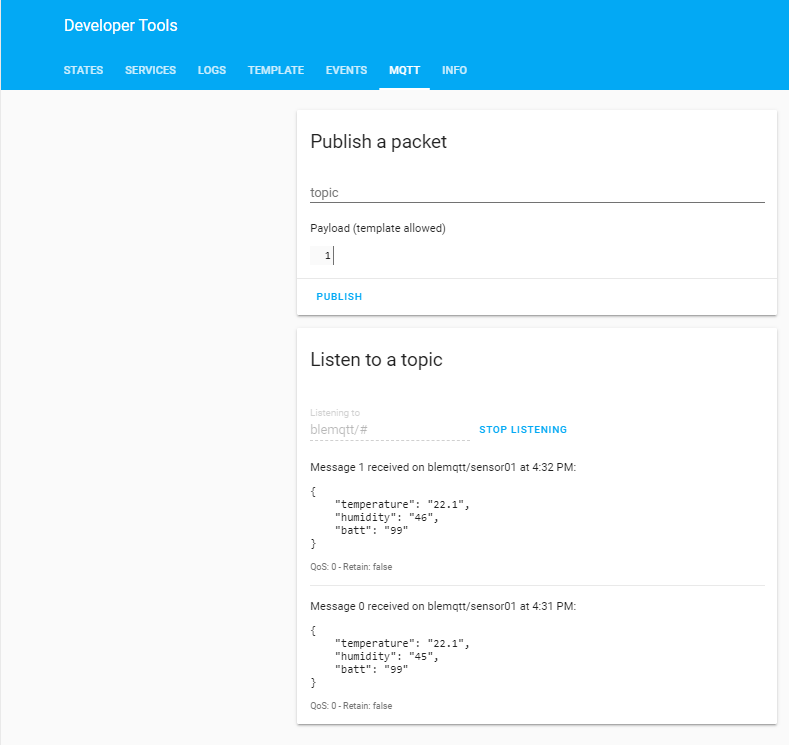

# Xiaomi BLE Tempertaure Display for Home Assistant
## Introduction
I have developed this project to integrate the Xiaomi LYWSD03MMC LCD temperature and Humidity display with Home Assistant. 

<p align="center">
  
</p>

The display outpus Temperature, Humidity and Battery level using Bluetooth Low Energy (BLE). This means we need some sort of hub to collect the data and render it in a way that Home Assistant understands. I chose to use a Raspberry Pi W for this job as it has built-in support for BLE. MQTT is an efficient way for remote devices to communicate with Home Assistant, so I added suport for this.
## Building The Solution
* The first thing you need to do is to get the latest version of Raspbian running on your Pi W. You can find out how to do that here https://all4pi.com/uncategorized/headless-raspberry-pi-setup-in-twenty-minutes/
* Now copy the files:
  * blemqtt.sh
  * ble_scan_example.py
  * LYWSD03MMC.py
  to the /home/pi folder  
* LYWSD03MMC.py is the main script that does all the work. It was taken from https://github.com/JsBergbau/MiTemperature2
  All I have done is added a few lines to output the data to MQTT. The oly change you need to make is 
  ```
  hostname = "192.168.0.99"   # address of MQTT server
  ```
  where you must enter the name, or IP address of your MQTT server.
* ble_scan_example.py is from https://gist.github.com/bgloh/3c7dd0c754a0b596e8ef6225199adc1e. I have reproduced here, unchanged. You will need to run this to discover the address of your device
  run
```
sudo python3 ble_scan_example.py
```
  and you should see something like
```
pi@blemqtt:~ $ sudo python3 ble_scan_example.py
Discovered device 03:9b:b5:ed:03:d0
Discovered device 31:47:ac:8e:6a:da
Discovered device 71:c1:c7:aa:1e:97
Discovered device 78:68:80:6c:7d:f8
Discovered device a4:c1:38:cf:bc:2f
Device 03:9b:b5:ed:03:d0 (random), RSSI=-44 dB
  Manufacturer = 0600010920028d51fa01483a4ff6e1c4d346eb1c8934b551fc648e32c5
Device 31:47:ac:8e:6a:da (random), RSSI=-74 dB
  Manufacturer = 060001092002051320e72ca80f7178064cbd28da8dd1df01d02a84c768
Device 71:c1:c7:aa:1e:97 (random), RSSI=-41 dB
  Flags = 1a
  Tx Power = 0c
  Manufacturer = 4c0010051a1889179c
Device 78:68:80:6c:7d:f8 (random), RSSI=-88 dB
  Complete 16b Services = 0000fe9f-0000-1000-8000-00805f9b34fb
  16b Service Data = 9ffe02397a2d505378524643724900000170421a8a9e
  Manufacturer = e000002cca367d06
Device a4:c1:38:cf:bc:2f (public), RSSI=-43 dB
  Flags = 06
  16b Service Data = 95fe30585b05012fbccf38c1a4280100
  Complete Local Name = LYWSD03MMC

```
This shows the address of the LYWSD03MMC as a4:c1:38:cf:bc:2f
* now edit blemqtt.sh and change the address to match the one you have just discovered
```
#!/bin/bash
/home/pi/LYWSD03MMC.py -d a4:c1:38:cf:bc:2f -r -b 5
```  
  you will probably need to use chmod to make the script execustable```
``` 
sudo chmod 777 blemqtt.sh
```
8 now try
```
./blemqtt.sh
```
  if all is well you should see an output like this
```
Trying to connect to a4:c1:38:cf:bc:2f
Battery-Level: 99
Temperature: 22.1
Humidity: 46
```
* to test the MQTT output we can use Home Assistant
 Just open up Developer Tools and go to the MQTT tab
 enter blemqtt/# next to **Listening to** under the **Listen to a topic** tab and click on **START LISTENING**
 <p align="center">
  
</p>
 
You should see an output like the one above.
* next step is make it run automatically. For this we use a Systemd service
  copy blemqtt.service to /etc/systemd/system. If you used my setup guide, you can do this straight from you windows desktop.
  
