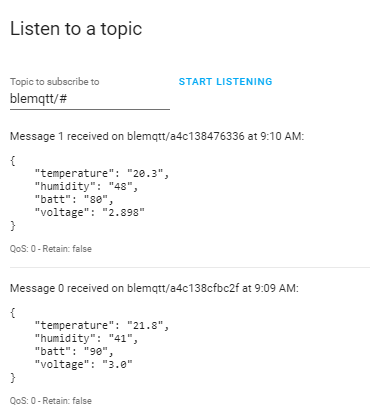
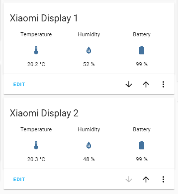

# Xiaomi BLE Temperature Display for Home Assistant
## Introduction
I have developed this project to integrate the Xiaomi LYWSD03MMC LCD temperature and Humidity display with Home Assistant. 

<p align="center">
  
</p>

The display outputs Temperature, Humidity and Battery level using Bluetooth Low Energy (BLE). This means we need some sort of hub to collect the data and render it in a way that Home Assistant understands. I chose to use a Raspberry Pi W for this job as it has built-in support for BLE. MQTT is an efficient way for remote devices to communicate with Home Assistant, so I added suport for this.
## Building The Solution
* The first thing you need to do is to get the latest version of Raspbian running on your Pi W. You can find out how to do that here https://all4pi.com/uncategorized/headless-raspberry-pi-setup-in-twenty-minutes/
* Now copy the files:
  * ble_scan_example.py
  * LYWSD03MMC.py
  to the /home/pi folder  
* LYWSD03MMC.py is the main script that does all the work. It was taken from https://github.com/JsBergbau/MiTemperature2
  All I have done is added a few lines to output the data to MQTT. 
  
  You will need to install bluepy https://github.com/IanHarvey/bluepy using
  ```
  $ sudo apt-get install python3-pip libglib2.0-dev
  $ sudo pip3 install bluepy
'''
* ble_scan_example.py is from https://gist.github.com/bgloh/3c7dd0c754a0b596e8ef6225199adc1e. I have reproduced here, unchanged. You will need to run this to discover the addresses of your devices
  run
```
sudo python3 ble_scan_example.py
```
  and you should see something like
```
pi@blemqtt:~ $ sudo python3 ble_scan_example.py

Discovered device 3c:17:d7:ab:f7:06
Discovered device 40:4f:b3:b6:b6:17
Discovered device 3e:51:38:b1:f8:55
Discovered device 47:47:07:c5:04:ce
Discovered device a4:c1:38:47:63:36
Discovered device a4:c1:38:cf:bc:2f
Device 3c:17:d7:ab:f7:06 (random), RSSI=-38 dB
  Manufacturer = 06000109200229b65e67ce53796462619258a2e8d9d821b042c64a9d6c
Device 40:4f:b3:b6:b6:17 (random), RSSI=-52 dB
  Flags = 1a
  Tx Power = 0c
  Manufacturer = 4c0010051e18007e35
Device 3e:51:38:b1:f8:55 (random), RSSI=-31 dB
  Manufacturer = 060001092002a571ac5d960234bc8f8a413c5e3b1bae57f52b63520a5f
Device 47:47:07:c5:04:ce (random), RSSI=-88 dB
  Complete 16b Services = 0000fe9f-0000-1000-8000-00805f9b34fb
  16b Service Data = 9ffe02724842695474593875766700000170e8543f92
  Manufacturer = e000002cca367d06
Device a4:c1:38:47:63:36 (public), RSSI=-64 dB
  Flags = 06
  16b Service Data = 95fe30585b050136634738c1a4280100
  Complete Local Name = LYWSD03MMC
Device a4:c1:38:cf:bc:2f (public), RSSI=-63 dB
  Flags = 06
  16b Service Data = 95fe30585b05012fbccf38c1a4280100
  Complete Local Name = LYWSD03MMC
```
This shows the addresses of two LYWSD03MMC devices as a4:c1:38:47:63:36 and a4:c1:38:cf:bc:2f

now run
```
/home/pi/LYWSD03MMC.py -d a4:c1:38:cf:bc:2f,a4:c1:38:47:63:36 -r -b 5 -c 1 -m 192.168.0.99 -del 20
```
where ```-d a4:c1:38:cf:bc:2f,a4:c1:38:47:63:36``` should be a comma-separated list of your device mac addresses - no spaces!
and ```-m 192.168.0.99``` should be the ip address, or name, of your MQTT server.
and ```-d 20``` is the number of seconds between reading each device


if all is well you should see an output like this
```
Trying to connect to a4:c1:38:cf:bc:2f
Temperature: 21.7
Humidity: 41
Battery voltage: 2.991
Battery level: 89
1 measurements collected. Exiting in a moment.
Topic blemqtt/a4c138cfbc2f
measurements deque([Measurement(temperature=21.7, humidity=41, voltage=2.991, calibratedHumidity=0, battery=89, timestamp=1585126373)])
21.7
Publishing {"temperature": "21.7", "humidity": "41", "batt": "89", "voltage": "2.991"}

Connection lost
Waiting...
Trying to connect to a4:c1:38:47:63:36
Temperature: 20.3
Humidity: 47
Battery voltage: 2.788
Battery level: 69
1 measurements collected. Exiting in a moment.
Topic blemqtt/a4c138476336
measurements deque([Measurement(temperature=20.3, humidity=47, voltage=2.788, calibratedHumidity=0, battery=69, timestamp=1585126412)])
20.3
Publishing {"temperature": "20.3", "humidity": "47", "batt": "69", "voltage": "2.788"}
Connection lost
Waiting...
```

* to test the MQTT output we can use Home Assistant
 Just open up Developer Tools and go to the MQTT tab
 enter blemqtt/# next to **Listening to** under the **Listen to a topic** tab and click on **START LISTENING**
 
 <p align="center">
  
</p>
 
You should see an output like the one above.
* next step is make it run automatically. For this we use a Systemd service
  copy blemqtt.service to /etc/systemd/system. If you used my setup guide, you can do this straight from you windows desktop.
* Run
```
sudo systemctl enable blemqtt
sudo systemctl start blemqtt
```
  If you repeat the step where you listen for the topic in Home Assistant, you should see the values coming through.
* Now we are going to create the sensors in Home assistant. You will need to edit your onfiguration.yaml. I use the Configurator Add-on.
Add in these entries:
```
sensor:
  - platform: mqtt
    name: "Temperature_x1"
    state_topic: "blemqtt/a4c138476336"
    unit_of_measurement: '°C'
    device_class: "temperature"
    value_template: "{{ value_json.temperature }}"
    
  - platform: mqtt
    name: "Humidity_x1"
    state_topic: "blemqtt/a4c138476336"
    device_class: "humidity"
    unit_of_measurement: '%'
    value_template: "{{ value_json.humidity }}"
     
  - platform: mqtt
    name: "Battery_x1"
    state_topic: "blemqtt/a4c138476336"
    device_class: "battery"
    unit_of_measurement: '%'
    value_template: "{{ value_json.batt }}"
     
  - platform: mqtt
    name: "Temperature_x2"
    state_topic: "blemqtt/a4c138cfbc2f"
    unit_of_measurement: '°C'
    device_class: "temperature"
    value_template: "{{ value_json.temperature }}"
    
  - platform: mqtt
    name: "Humidity_x2"
    state_topic: "blemqtt/a4c138cfbc2f"
    device_class: "humidity"
    unit_of_measurement: '%'
    value_template: "{{ value_json.humidity }}"
     
  - platform: mqtt
    name: "Battery_x2"
    state_topic: "blemqtt/a4c138cfbc2f"
    device_class: "battery"
    unit_of_measurement: '%'
    value_template: "{{ value_json.batt }}"
```
  If you already have a sensor: tag then add these underneath it. If you duplicate it, you will get an error.
  In order to make these changes live you will have to restart Home Assistant. The easiest way is to do this is to go into **Developer Tools** and select the **SERVICES** tab. Select the **homeassistant.restart** Service and click on **CALL SERVICE**.
  You will get the **Connection lost. Reconnecting...** message for a while.
  
  * once this is finished we can have a look at our values.
  In the **Overview** go into edit mode by clicking on the three little vertical dots in the top right of the page. Then select **Configure UI**.
  In the bottonm right, click on the **+** button to make a new card. Select **Glance**. In the card, click on **SHOW CODE EDITOR**, and copy in the following code
 ```
entities:
  - entity: sensor.temperature_x1
    name: Temperature
  - entity: sensor.humidity_x1
    name: Humidity
  - entity: sensor.battery_x1
    name: Battery
title: Xiaomi Display 1
type: glance
```
Repeat this for display 2 using _x2_ instead of _x1_
If all is well you should see something like this:
<p align="center">
  
</p>

  


